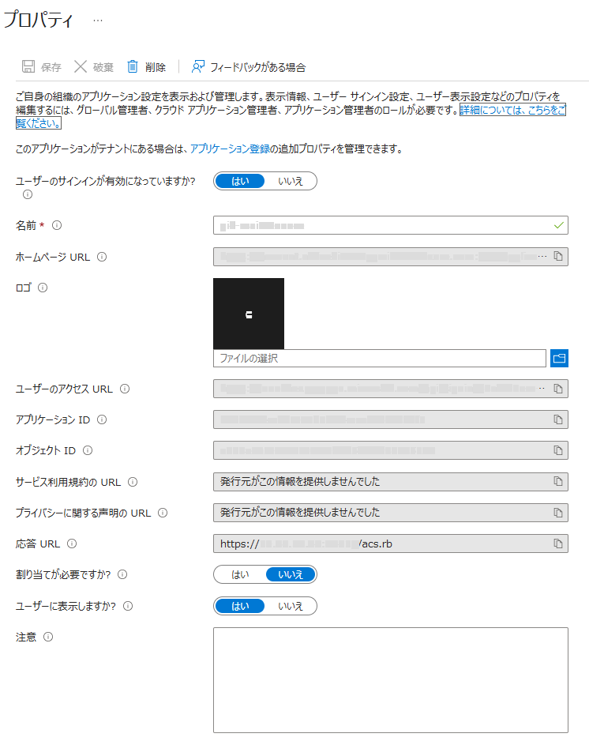

# IIS + Ruby CGIでEntraIDを使用してSAML認証

## 概要
Ruby CGIを使ってSAML認証の動きを確認！
使用しているライブラリ : ruby-saml

## 環境
* IIS
* Ruby
* Entra ID

## 設定
1. Ruby
	1. rubyのインストール

	2. ruby-saml

		``` bash
		gem install ruby-saml
		```

		※バージョンによっては、nokogiriのインストールでエラーになるのでエラーメッセージに従って適宜インストールするバージョンを選択  
		[https://github.com/SAML-Toolkits/ruby-saml](https://github.com/SAML-Toolkits/ruby-saml) 参照

	3. その他
		Railsを使用しない場合(CGI等)、LoggerがSTDOUTに出力されるようになっているので適宜、出力先を変更する。  
		※サンプルではStringIOに捨てている

2. Internet Information Services
	1. IIS インストール (CGI)
		コントールパネル > Windowsの機能の有効化または無効化 > アプリケーション開発 > CGI  
		
		

	2. IISの設定
		ハンドラーマッピング > スクリプトマップの追加
		

		要求パス : *.rb
		実行可能ファイル : C:\...\bin\ruby.exe "%s" %s
		名前 : Ruby CGI
		

	3. 証明書
		1. mkcertのインストール
			```bash
			choco install mkcert
			```
			※又は、[https://github.com/FiloSottile/mkcert/releases](https://github.com/FiloSottile/mkcert/releases)からmkcert-v1.4.4-windows-arm64.exeをダウンロード

		2. CA証明書の作成および証明書ストアへのインストール
			```bash
			mkccert -install
			```
		
		3. CA証明書保存ディレクトリの確認
			mkcert -CAROOT で確認可能  
			rootCA.pem, rootCA-key.pem というファイルがあるはず。
		
		4. サーバー証明書を作成
			mkcert -pkcs12 ドメイン名 or IPアドレス  
			※念のため拡張子をp12をpfxに変更
		
		5. 証明書のインポート
			pfxをダブルクリック  
			保存場所 : ローカルコンピュータ  
			パスワード : changeit  
			
			
			
			
			


		6. 信頼されたルート証明書
			certmgr.msc  
			個人 : インポートした証明書をコピー  
			信頼されたルート証明書機関 : コピーした証明書を貼り付け  
			
			

		7. バインド
			IIS > サイト > Site > バインドの編集  
			追加  
			種類 : https  
			SSL 証明書 : インストールした証明書  
			
			

		8. クライアントPC
			1. クライアントPCにrootCA.pemをrootCA.crtに名前を変更してコピー
			2. クライアントPCでrootCA.crt をダブルクリック
			3. 「証明書のインポート ウィザード」が開いたら進む
			4. 「ローカルマシン」を選択（管理者権限が必要）
			5. 「証明書をすべて次のストアに配置する」を選び、  
				　　→「信頼されたルート証明機関」を選択
			6. 完了したら「OK」で閉じて、インポートを完了

	4. その他
		ログにユーザーIDが出るようにする  
		

3. Microsoft Entra ID
	1. エンタープライズアプリケーション
		[https://entra.microsoft.com/](https://entra.microsoft.com/)
		アプリケーション > エンタープライズアプリケーション

		

	2. 独自のアプリケーション
		1. 新しいアプリケーション
			

		2. 独自のアプリケーションの作成
			

		3. アプリの名前を設定して「作成」
			

	3. シングル サインオンの設定
		シングル サインオンの設定
		

	4. SAML構成
		
		基本的なSAML構成 設定  
		編集  
		識別子(エンティティID) : https://.../metadata [エンティティID]  
		応答 URL (Assertion Consumer Service URL) : https://.../acs.rb [応答 URL]  

	5. 属性
		属性とクレーム  
		編集  
		必要用に応じて変更  
			※今回は名前空間の設定なし  

	6. 証明書
		
		SAML 証明書  
		証明書 (Base64) > ダウンロード [証明書]  

		
		ログインURL : コピーしておく [ログインURL]  
		Microsoft Entra 識別子 : コピーしておく [Microsoft Entra 識別子]  

	7. ユーザー
		適宜(今回は、個別に割り当てない。割り当てが必要ですか？：いいえ)
		

4. CGI
	1. ファイルの配置
		acs.rb  
		auth_helper.rb  
		config.rb  
		page1.rb  

	2. 認証設定
		config.rb  
		assertion_consumer_service_url : [応答 URL]  
		issuer : [エンティティID]  
		idp_entity_id : [Microsoft Entra 識別子]  
		idp_sso_target_url : [ログインURL]  
		idp_cert : [証明書]  
		

	3. 属性
		一意の値 : response.nameid  
		追加の属性の値 ： response.attributes["xxxx"]  
			※名前空間を設定した場合には、キーに名前空間を含める